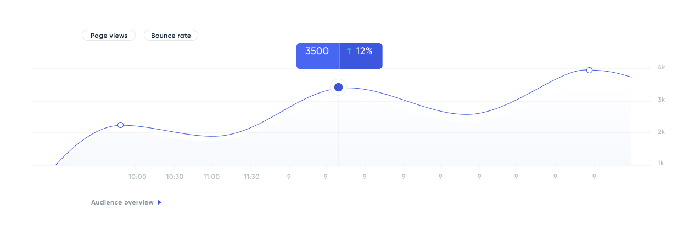

# BSA 2019 | PHP | Metrica

[](https://travis-ci.org/BinaryStudioAcademy/bsa-2019-metrica)
[](https://www.codacy.com/app/lenchvolodymyr/bsa-2019-metrica?utm_source=github.com&amp;utm_medium=referral&amp;utm_content=BinaryStudioAcademy/bsa-2019-metrica&amp;utm_campaign=Badge_Grade)
[](https://github.styleci.io/repos/199579591)
[](LICENSE)

## Description

[Metrica](https://metrica.fun) is an analog of Google Analytics. The main purpose is to collect data from web pages, handle it and visualize.

[](https://metrica.fun)

## Installation. Unix

```bash
cp docker-compose.override.yml.general docker-compose.override.yml
cp .env.example .env

docker-compose run --rm frontend npm install

docker-compose up -d

cp backend/.env.example backend/.env
docker-compose exec app composer install
docker-compose exec app php artisan key:generate
docker-compose exec app php artisan jwt:secret
docker-compose exec app php artisan migrate --seed

cp frontend/.env.example frontend/.env
```

Open browser:

`https://localhost:8443`

## Installation. Windows

First of all make sure you have installed `node:12.7`. 

```bash
cp docker-compose.override.yml.windows docker-compose.override.yml
cp .env.example .env
docker-compose up -d

docker-compose exec app composer install

docker-compose exec app php artisan key:generate
docker-compose exec app php artisan jwt:secret
docker-compose exec app php artisan migrate --seed

cp frontend/.env.example frontend/.env

cd frontend
npm install

npm run serve
```

Open browser:

`http://localhost:3000`

### Setup pusher

Sign up [Pusher](https://pusher.com).

Create application.

Fill `backend/.env` variables:

```bash
BROADCAST_DRIVER=pusher
PUSHER_APP_ID=
PUSHER_APP_KEY=
PUSHER_APP_SECRET=
PUSHER_APP_CLUSTER=
```

Fill `frontend/.env` variables:

```bash
PUSHER_APP_KEY=
PUSHER_CLUSTER=
PUSHER_AUTH_ENDPOINT=/broadcasting/auth
```

### Build tracking JS script

Setup `.env` file in the frontend directory

```
VUE_APP_API_URL=
VUE_APP_URL=
```

then run command

```bash
docker-compose exec frontend npm run build:script
```

### Contributors

[](https://github.com/ltopchyi)
[](https://github.com/Ilya-Lopanosov)
[](https://github.com/yashuk803)
[](https://github.com/TumkoVolodymyr)
[](https://github.com/mes1901)
[](https://github.com/UMarina)
[](https://github.com/SerhiiPlotnikov)
[](https://github.com/wyyi)
[](https://github.com/KoR82)
[](https://github.com/naytis)
[](https://github.com/devhackerone)

### Elasticsearch troubleshoot

The vm.max_map_count kernel setting needs to be set to at least 262144 for production use. Depending on your platform:

#### Linux

$ sysctl -w vm.max_map_count=262144

#### macOS with Docker for Mac

$ screen ~/Library/Containers/com.docker.docker/Data/vms/0/tty

sysctl -w vm.max_map_count=262144

#### Windows and macOS with Docker Toolbox

docker-machine ssh
sudo sysctl -w vm.max_map_count=262144

or

```bash
docker-machine ssh

tce-load -w -i nano.tcz

sudo sysctl -w vm.max_map_count=262144

cat /proc/sys/vm/max_map_count

sudo nano /mnt/sda1/var/lib/boot2docker/profile

# put this line in the end of file
sudo sysctl -w vm.max_map_count=262144

# save it

Ctrl+O

exit

docker-machine restart default
```

### Copyright and License

Metrica was written by PHP team of Binary Studio Academy in 2019 and is released under the [MIT License](https://github.com/BinaryStudioAcademy/bsa-2019-metrica/blob/master/LICENSE).

Copyright (c) 2019 Binary Studio Academy
